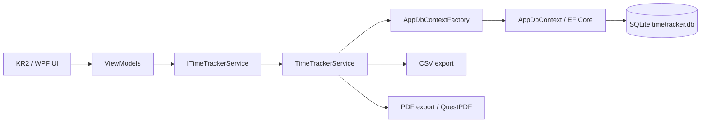
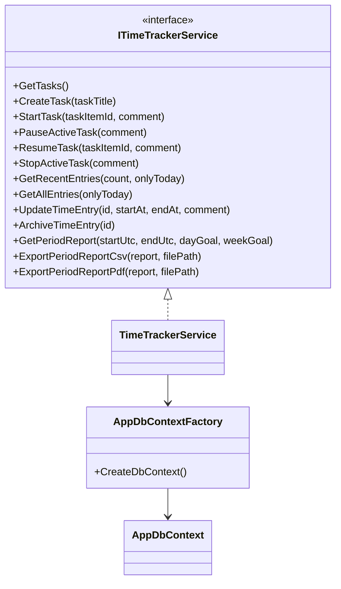
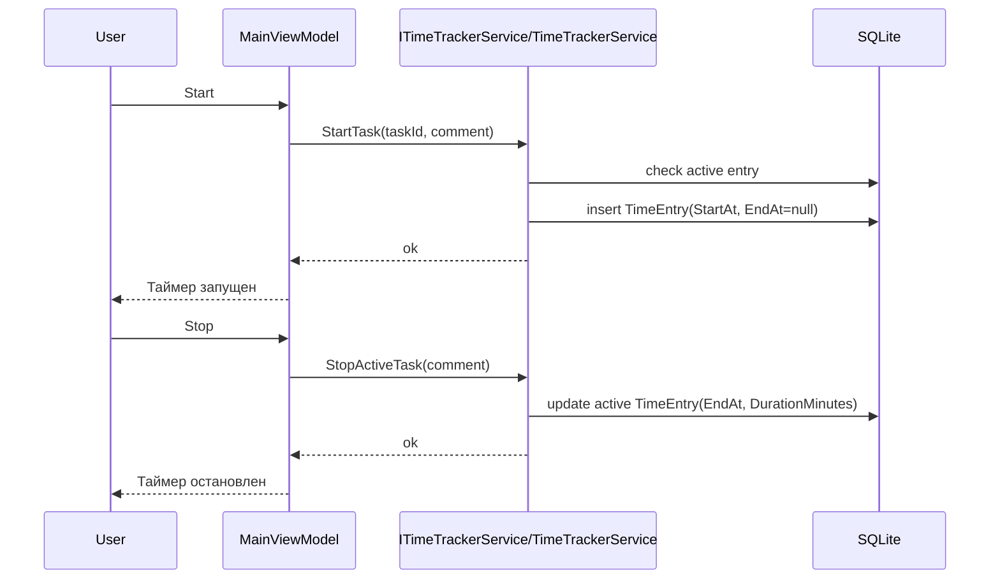
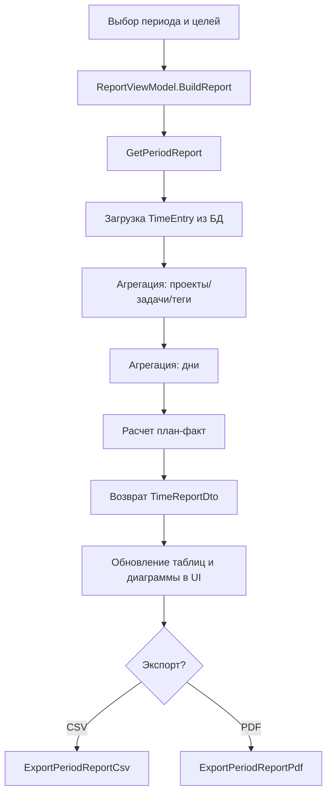
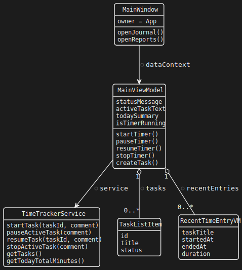
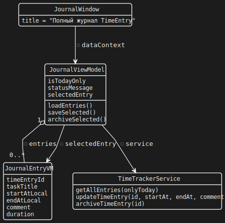
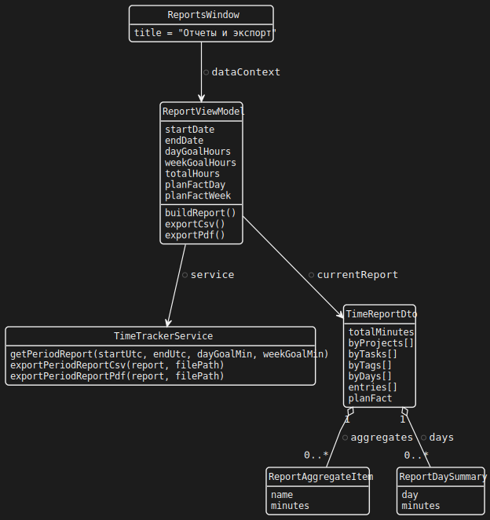
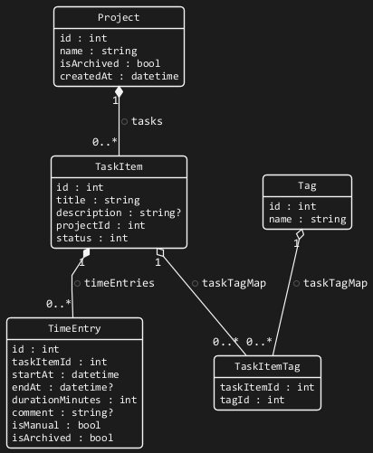
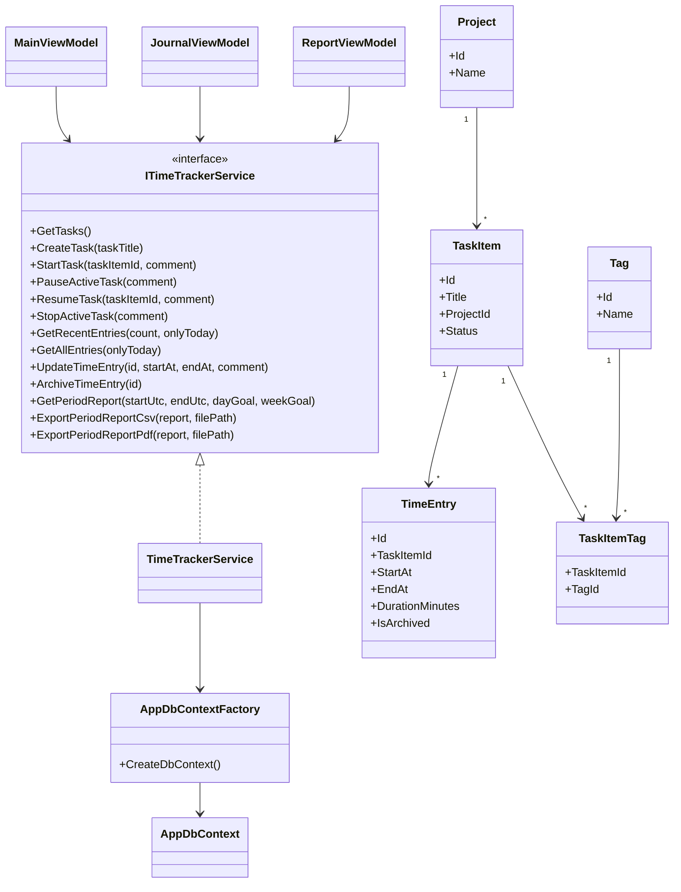

# TimeTracker (KR2)

Единый отчет по проекту: описание, запуск, архитектура, UML и технические детали.

## Содержание

1. [Что это](#1-что-это)
2. [Возможности](#2-возможности)
3. [Структура решения](#3-структура-решения)
4. [Технологии](#4-технологии)
5. [Запуск проекта](#5-запуск-проекта)
6. [Запуск тестов](#6-запуск-тестов)
7. [Архитектура и взаимодействие](#7-архитектура-и-взаимодействие)
8. [Основные модули](#8-основные-модули)
9. [UML: классы, sequence, activity](#9-uml-классы-sequence-activity)
10. [UML по окнам](#10-uml-по-окнам)
11. [ER-диаграмма БД](#11-er-диаграмма-бд)
12. [Как работают ключевые функции](#12-как-работают-ключевые-функции)
13. [Ограничения](#13-ограничения)
14. [Рекомендации по развитию](#14-рекомендации-по-развитию)
15. [Где лежат UML-файлы](#15-где-лежат-uml-файлы)

---

## 1) Что это

`TimeTracker` - desktop-приложение на WPF для учета рабочего времени по задачам.

## 2) Возможности

- запуск, пауза, продолжение и остановка таймера;
- журнал записей времени и редактирование интервалов;
- отчеты за период (по проектам, задачам, тегам);
- план-факт (цели на день/неделю);
- экспорт отчетов в CSV/PDF;
- визуализация часов по дням.

## 3) Структура решения

В решении 4 проекта:

- `KR2` - UI слой (WPF окна + ViewModels);
- `TimeTracker.Core` - доменные сущности, DTO, интерфейсы;
- `TimeTracker.Infrastructure` - EF Core (SQLite), сервисы и экспорт;
- `TimeTracker.Tests` - тестовый проект (`xUnit`).

Файл решения: `KR2.slnx`.

## 4) Технологии

- `.NET 8`
- `WPF` (`net8.0-windows`)
- `Entity Framework Core` + `SQLite`
- `QuestPDF`
- `xUnit`
- `PlantUML`

## 5) Запуск проекта

Требования:

- Windows
- .NET SDK 8

Команды из корня репозитория:

```powershell
dotnet restore KR2.slnx
dotnet build KR2.slnx
dotnet run --project .\KR2\KR2.csproj
```

## 6) Запуск тестов

```powershell
dotnet test KR2.slnx
```

## 7) Архитектура и взаимодействие



Поток вызовов:

1. ViewModel вызывает методы `ITimeTrackerService`.
2. Сервис открывает `AppDbContext` через `AppDbContextFactory`.
3. Выполняется чтение/изменение данных в SQLite.
4. Результаты возвращаются в UI.

## 8) Основные модули

### 8.1 UI слой (`KR2`)

- `MainWindow` + `MainViewModel`: таймер, задачи, дашборд, переходы.
- `JournalWindow` + `JournalViewModel`: записи времени, редактирование, архивация.
- `ReportsWindow` + `ReportViewModel`: период, цели, агрегаты, экспорт.

### 8.2 Core слой (`TimeTracker.Core`)

- Сущности: `Project`, `TaskItem`, `TimeEntry`, `Tag`, `TaskItemTag`, `User`.
- Контракт: `ITimeTrackerService`.
- DTO: `TaskItemDto`, `RecentTimeEntryDto`, `TimeReportDto` и связанные модели.

### 8.3 Infrastructure слой (`TimeTracker.Infrastructure`)

- `AppDbContext` - таблицы и связи.
- `AppDbContextFactory` - создание контекста SQLite.
- `TimeTrackerService` - бизнес-операции таймера, журнала, отчетов и экспорта.

## 9) UML: классы, sequence, activity

### 9.1 UML диаграмма классов (упрощенная)



### 9.2 UML sequence: запуск и остановка таймера



### 9.3 UML activity: построение отчета за период



## 10) UML по окнам

### 10.1 Main Window (`MainWindow` + `MainViewModel`)

Исходник: `docs/uml/main-window.puml`



### 10.2 Journal Window (`JournalWindow` + `JournalViewModel`)

Исходник: `docs/uml/journal-window.puml`



### 10.3 Reports Window (`ReportsWindow` + `ReportViewModel`)

Исходник: `docs/uml/reports-window.puml`



## 11) ER-диаграмма БД

Исходник: `docs/uml/database-er.puml`



Пояснение по ключам:

- `TaskItem.ProjectId` -> `Projects.Id`
- `TimeEntry.TaskItemId` -> `TaskItems.Id`
- `TaskItemTag` имеет составной PK: (`TaskItemId`, `TagId`)
- `TaskItemTag.TaskItemId` -> `TaskItems.Id`
- `TaskItemTag.TagId` -> `Tags.Id`

## 12) Как работают ключевые функции

### 12.1 Таймер

- `StartTask` запрещает запуск, если уже есть активный `TimeEntry`.
- `PauseActiveTask` завершает текущую запись без перевода задачи в `Done`.
- `StopActiveTask` завершает запись и переводит задачу в `Done`.

### 12.2 Журнал

- Отображает записи (все или только за сегодня).
- Позволяет менять `StartAt/EndAt/Comment`.
- Проверяет пересечения интервалов в рамках задачи.
- Поддерживает мягкое удаление через `IsArchived`.

### 12.3 Отчеты

- Получает диапазон дат и цели (день/неделя).
- Формирует агрегаты по проектам, задачам, тегам и дням.
- Считает план-факт по дневной и недельной цели.

### 12.4 Экспорт

- CSV: строки детализации + итоговые значения.
- PDF: сводка, таблицы по дням и задачам, детализация.

## 13) Ограничения

- Используется `DateTime.UtcNow`; для сложных TZ-сценариев лучше `DateTimeOffset`.
- Пока нет полноценной миграционной стратегии EF (`EnsureCreated` + SQL добавления колонок).
- Теги пока не редактируются из UI.
- Недостаточно unit/integration тестов на отчетный функционал.

## 14) Рекомендации по развитию

1. Добавить EF Core Migrations и versioned schema updates.
2. Добавить тесты на план-факт, агрегации, экспорт CSV/PDF.
3. Добавить фильтры отчета по проекту/задаче/тегу.
4. Добавить drill-down из диаграммы в список записей дня.

## 15) Где лежат UML-файлы

Файлы в `docs/uml`:

- `docs/uml/main-window.puml`
- `docs/uml/journal-window.puml`
- `docs/uml/reports-window.puml`
- `docs/uml/database-er.puml`
- `docs/uml/style-dark.puml`

Рендер PNG/SVG/PDF: `docs/uml/README.md` или `docs/uml/render.ps1`.
# TimeTracker (KR2)

Единый отчет по проекту для GitHub: что делает приложение, как запустить, как устроена архитектура и где смотреть UML-диаграммы.

## Что это

`TimeTracker` - desktop-приложение на WPF для учета рабочего времени по задачам.

Основные возможности:
- запуск, пауза, продолжение и остановка таймера;
- журнал записей времени с редактированием интервалов;
- отчеты за период (проекты/задачи/теги);
- план-факт по целям;
- экспорт отчетов в CSV/PDF;
- визуализация часов по дням.

## Структура решения

В решении 4 проекта:
- `KR2` - UI слой (WPF окна + ViewModels);
- `TimeTracker.Core` - доменные сущности, DTO, интерфейсы;
- `TimeTracker.Infrastructure` - EF Core (SQLite), сервисы и экспорт;
- `TimeTracker.Tests` - тестовый проект (`xUnit`).

Файл решения: `KR2.slnx`.

## Технологии

- `.NET 8`
- `WPF` (`net8.0-windows`)
- `Entity Framework Core` + `SQLite`
- `QuestPDF`
- `xUnit`
- `PlantUML` (для UML-диаграмм)

## Как запустить проект

Требования:
- Windows
- .NET SDK 8

Команды из корня репозитория:

```powershell
dotnet restore KR2.slnx
dotnet build KR2.slnx
dotnet run --project .\KR2\KR2.csproj
```

## Как запускать тесты

```powershell
dotnet test KR2.slnx
```

## Архитектура (кратко)

Поток вызовов:
1. `ViewModel` в `KR2` вызывает `ITimeTrackerService`.
2. Реализация `TimeTrackerService` работает через `AppDbContextFactory`.
3. `AppDbContext` читает/изменяет данные в SQLite.
4. Результаты возвращаются в UI.

## UML-диаграммы

UML хранится в `docs/uml`.

Диаграммы:
- `main-window.puml` - структура главного окна;
- `journal-window.puml` - структура окна журнала;
- `reports-window.puml` - структура окна отчетов;
- `database-er.puml` - ER-диаграмма базы данных.

Общий стиль: `docs/uml/style-dark.puml`.

### Быстрый рендер UML

В папке `docs/uml` есть скрипт `render.ps1`, который генерирует `.png` и `.svg`:

```powershell
cd .\docs\uml
.\render.ps1
```

### Готовые картинки (после рендера)


---

## Технический отчет (подробно)

## 1) Что это за проект

`TimeTracker` - desktop-приложение на WPF для учета рабочего времени по задачам.  
Решение разделено на 3 слоя:

- `KR2` - UI (WPF окна + ViewModel).
- `TimeTracker.Core` - доменные сущности, DTO, интерфейсы сервисов.
- `TimeTracker.Infrastructure` - EF Core (SQLite), реализация бизнес-логики, экспорт CSV/PDF.

Ключевые возможности:

- запуск/пауза/продолжение/остановка таймера;
- журнал записей времени и редактирование;
- отчет за период (по проектам, задачам, тегам);
- план-факт (цели на день/неделю);
- экспорт отчета в CSV/PDF;
- простая диаграмма "часы по дням".

---

## 2) Архитектура и взаимодействие слоев


Паттерн взаимодействия:

1. ViewModel вызывает методы `ITimeTrackerService`.
2. Сервис открывает `AppDbContext` через `AppDbContextFactory`.
3. Выполняется чтение/изменение данных в SQLite.
4. ViewModel обновляет состояние UI.

---

## 3) Основные модули

### 3.1 UI слой (`KR2`)

- `MainWindow` + `MainViewModel`:
  - управление таймером;
  - список задач;
  - краткий дашборд;
  - переходы в журнал и отчеты.
- `JournalWindow` + `JournalViewModel`:
  - полный список `TimeEntry`;
  - редактирование интервалов;
  - архивация записей.
- `ReportsWindow` + `ReportViewModel`:
  - выбор периода;
  - цели план-факт;
  - агрегаты и диаграмма;
  - экспорт CSV/PDF.

### 3.2 Core слой (`TimeTracker.Core`)

- Сущности: `Project`, `TaskItem`, `TimeEntry`, `Tag`, `TaskItemTag`, `User`.
- Контракт: `ITimeTrackerService`.
- DTO:
  - `TaskItemDto`, `RecentTimeEntryDto`;
  - `TimeReportDto` и связанные модели отчетов.

### 3.3 Infrastructure слой (`TimeTracker.Infrastructure`)

- `AppDbContext` - описание таблиц и связей.
- `AppDbContextFactory` - создание контекста SQLite.
- `TimeTrackerService` - бизнес-операции:
  - таймер;
  - журнал;
  - отчеты;
  - экспорт.

---

## 4) UML диаграмма классов (упрощенная)



---

## 5) UML sequence: запуск и остановка таймера


---

## 6) UML activity: построение отчета за период


---

## 7) Структура данных (логическая)

- `Project` 1->N `TaskItem`
- `TaskItem` 1->N `TimeEntry`
- `TaskItem` N<->N `Tag` через `TaskItemTag`
- `TimeEntry` хранит:
  - временной интервал;
  - итог в минутах;
  - комментарий;
  - флаг архивности.

---

## 8) Как работают ключевые функции

### 8.1 Таймер

- `StartTask` запрещает запуск, если уже есть активный `TimeEntry`.
- `PauseActiveTask` завершает текущую запись без перевода задачи в `Done`.
- `StopActiveTask` завершает запись и переводит задачу в `Done`.

### 8.2 Журнал

- Отображает записи (все или только за сегодня).
- Позволяет менять `StartAt/EndAt/Comment`.
- Проверяет пересечения интервалов в рамках задачи.
- Поддерживает мягкое удаление через `IsArchived`.

### 8.3 Отчеты

- Получает диапазон дат и цели (день/неделя).
- Формирует агрегаты:
  - по проектам;
  - по задачам;
  - по тегам;
  - по дням.
- Вычисляет план-факт:
  - процент выполнения по дневной цели;
  - процент выполнения по недельной цели.

### 8.4 Экспорт

- CSV: строки детализации + итоговые значения.
- PDF: сводка, таблицы по дням и задачам, детализация по дням/задачам, детализация записей.

---

## 9) Ограничения и зоны улучшения

- Временная логика строится через `DateTime.UtcNow`; для сложных TZ-сценариев лучше перейти на `DateTimeOffset`.
- Нет полноценной миграционной стратегии EF (`EnsureCreated` + SQL добавления колонок).
- Теги пока не редактируются из UI (используются в отчетной модели при наличии данных).
- Нет unit/integration тестов на новый отчетный функционал.

---

## 10) Рекомендации по развитию

1. Добавить EF Core Migrations и versioned schema updates.
2. Добавить тесты:
   - расчеты план-факта;
   - корректность агрегаций;
   - экспорт CSV/PDF.
3. Добавить фильтры отчета по проекту/задаче/тегу.
4. Добавить drill-down из диаграммы в список записей дня.

---

## 11) UML по окнам приложения

### 11.1 Main Window (`MainWindow` + `MainViewModel`)

Исходник: `docs/uml/main-window.puml`


### 11.2 Journal Window (`JournalWindow` + `JournalViewModel`)

Исходник: `docs/uml/journal-window.puml`


### 11.3 Reports Window (`ReportsWindow` + `ReportViewModel`)

Исходник: `docs/uml/reports-window.puml`


---

## 12) Детальная ER-диаграмма БД

Исходник: `docs/uml/database-er.puml`


### Пояснение по ключам и ограничениям

- `TaskItem.ProjectId` -> `Projects.Id`
- `TimeEntry.TaskItemId` -> `TaskItems.Id`
- `TaskItemTag` имеет составной PK: (`TaskItemId`, `TagId`)
- `TaskItemTag.TaskItemId` -> `TaskItems.Id`
- `TaskItemTag.TagId` -> `Tags.Id`
- `Users` в текущем UI-потоке не используется, но таблица готова к мультипользовательскому расширению.

---

## 13) Готовые UML-файлы в стиле "как на фото"

Файлы лежат в `docs/uml`:

- `docs/uml/main-window.puml`
- `docs/uml/journal-window.puml`
- `docs/uml/reports-window.puml`
- `docs/uml/database-er.puml`
- `docs/uml/style-dark.puml` (общий визуальный стиль)

Инструкция по рендеру PNG/SVG/PDF: `docs/uml/README.md`.

